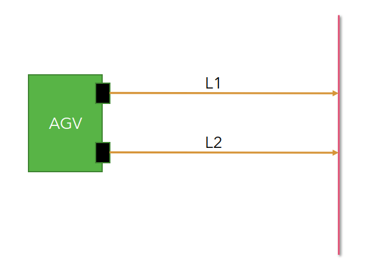
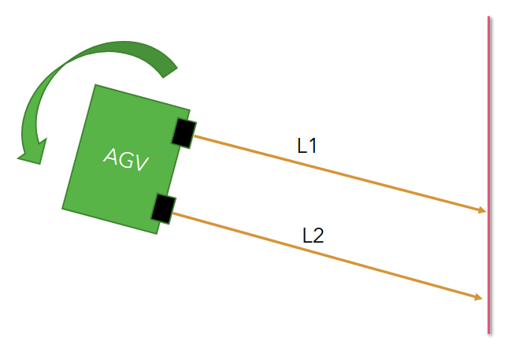
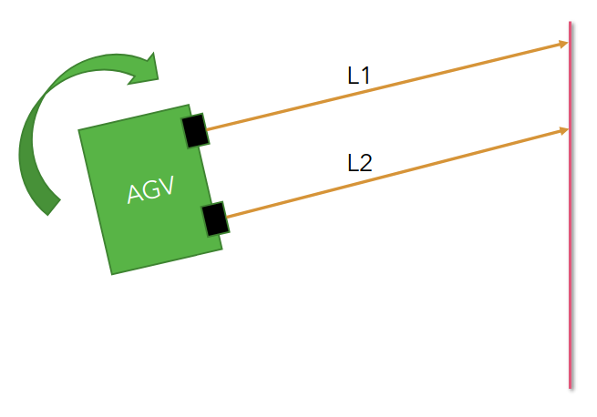
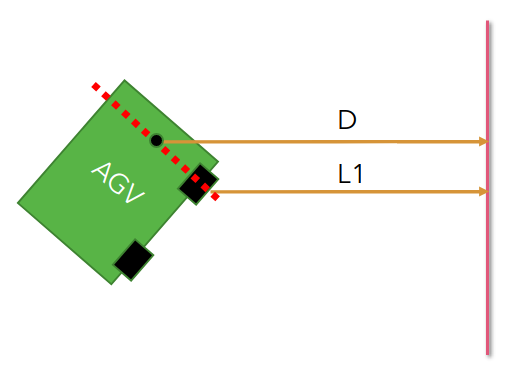
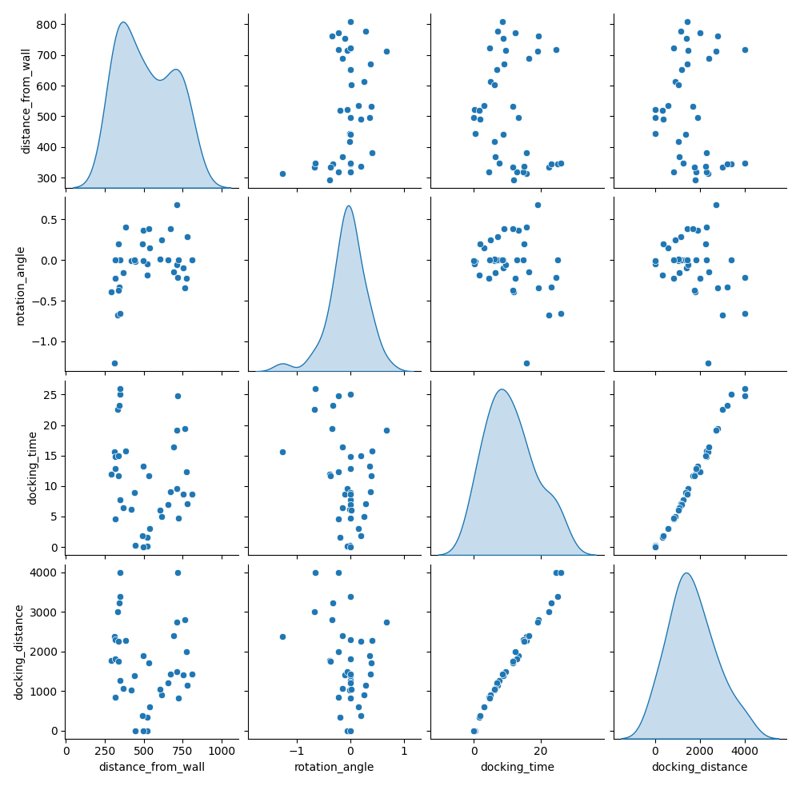
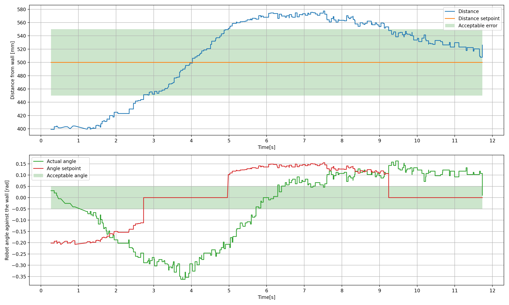
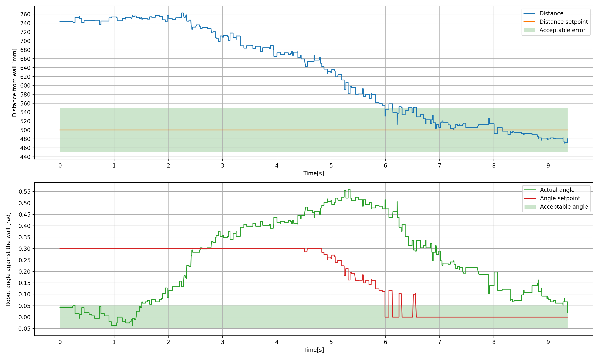
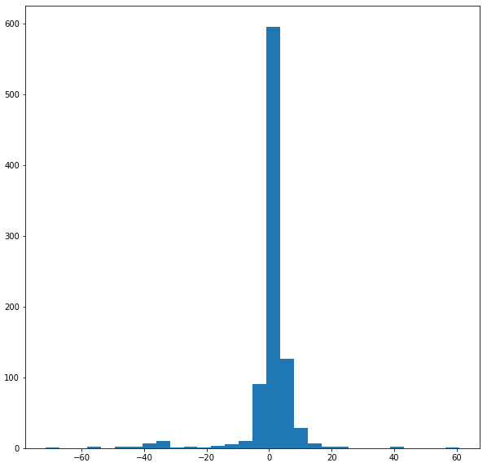

![license][]

# DISCLAIMER

Work is still in progress! 


# AGV-Autonomous-Docking
Algorithm for autonomous docking of AGV platform.

## Problem

Alrogithm that allows robot with differential drive to dock to two types of platforms:

Types of docking stations:
- Straight wall
- Walls in a shape of a letter "L"

Docking means positioning the robot with a proper alignemnt and distance to the wall or walls. 
 
## Solution

Solution was divided into three parts:
- Wheel control
- Alignment
- Distance control

All those parts are based on using PID controlers for different actions.

### Wheel Control

Each wheel has to be controlled individually. PID helps to generate adequate PWM signal that achieves choosen RPM under given conditions.   

Input - RPM
Output - PWM

|Settings   | Kp  | Ki  | Kd  | 
|:-:|:-:|:-:|:-:|
|  Right wheel |  6 | 5  | 0.1  |
|  Left wheel | 5  | 5  |  0.1 |

### Alignemnt

Next part of the algorithm is to align robot against the wall. In order to do that, another PID controller is used. It takes angle of required alignment as an input and as an output returns speed (RPM) of wheels which allows robot to rotate. 

Input - Angle
Output - RPM

| Settings  | Kp  | Ki  | Kd  | 
|:-:|:-:|:-:|:-:|
|  Wheel RPM |  3 | 0.5  | 0.008  |

<p align="center">
  
</p>

<p align = "center">
Fig.1 - Aligned robot
</p>


With help of differtial drive, robot can be rotated by spinning wheels in the opposite directions. RPM can be a positive or negative based on the direction in which the robot is suposed to turn. 

Black squares on the AGV platform are distance sensor, either Lidar or ToF. 

<p align="center">
  
</p>

<p align = "center">
Fig.2 - Rotation 1
</p>

<p align="center">
  
</p>

<p align = "center">
Fig.3 - Rotation 2
</p>

The advatage of this algorithm is that the robot can be aligned in any angle, between -0.3 and 0.3 radians. 

#### Angle calculation

Angle of the robot against the wall. 

Error is calculated as a difference betweeen L1 and L2. 

``
error = L1 - L2
``

```
 def get_angle(self, error):
     D = 195
     return math.asin(error/math.sqrt(D**2+error**2)) 
```

### Distance Control

As stated before, because robot can achive any angle alignemnt, it can be steered away or to the wall. This way, AGV can achieve any distance from the wall. 

PID responsible distance control, calculates the angle that the robot is supposed to achieve based on the difference between current distance and selected distance. 

Input - Difference between distances
Output - Angle

| Settings  | Kp  | Ki  | Kd  | 
|:-:|:-:|:-:|:-:|
| Angle |  0.002 | 0.00002  | 0.00002  |

#### Distance calculation

<p align="center">
  
</p>

<p align = "center">
Fig.4 - Distance measurement
</p>


```
 def get_distance_from_wall(self, l1, l2):
     # In mm
     X0 = 150
     Y0 = 87

     # d/l1 = cos(alfa) -> d = li

     angle = self.get_angle(l2-l1)

     d = l1 * math.cos(angle)

     return d + math.cos(angle) * X0 - math.sin(angle) * Y0  
```

Function above calculates distance of a point of the robot, which is placed in the center of the wheels axle. It is the same point around which AGV platform rotates. 

## Machine Learning -- IN PROGRESS!

System is be equiped with machine learning model that calculates the required distance that robot will have to drive in order to dock. 

The idea is that the model will estimate distance required for docking, based on initial distance from wall, rotation and distance setpoint.  

Regression model was crated with Deep Neural Network with Tensorflow Keras. The whole program is available in the link below.

[ML model in Jupter Notebook](https://github.com/szymciem8/AGV-Autonomous-Docking/blob/main/docking_prediction/regression.ipynb)

<br/>

<p align="center">
  
</p>

<p align = "center">
Fig.5 - Seaborn plot of model parameters
</p>

<p align="center">
  
</p>

<p align = "center">
Fig.6 - Docking procedure with base speed of 2.8 [rad/s]
</p>

<p align="center">
  
</p>

<p align = "center">
Fig.7 - Docking procedure with base speed of 2.5 [rad/s]
</p>

<p align="center">
  
</p>

<p align = "center">
Fig.8 - Histogram of model errors
</p>

## Techonologies

- Python
- ROS
- Nvidia Xavier

## Sensors

- Lidar
- ToF

[license]:https://img.shields.io/github/license/szymciem8/AGV-Autonomous-Docking
